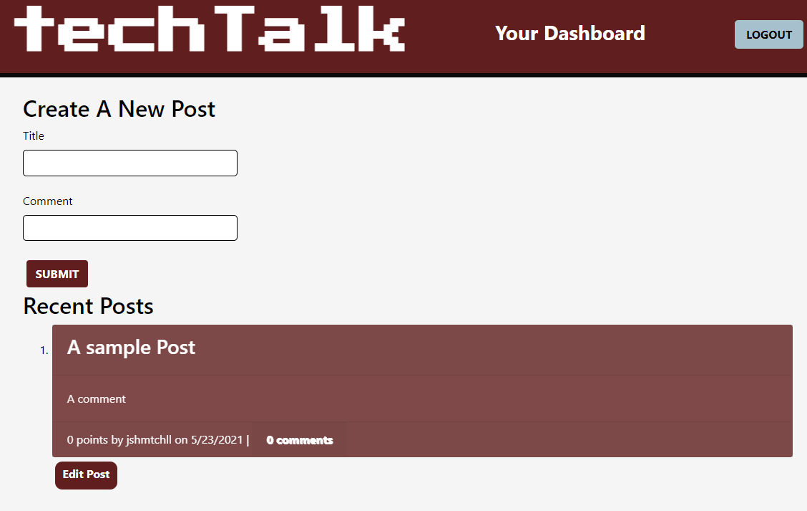

# a-tech-blog

## Description 

a CMS-style blog site similar to a Wordpress site, where developers can publish their blog posts and comment on other developers’ posts as well. This app follows the MVC paradigm in it's structure, using handlebars.js as the templating language, Sequelize as the ORM and the express-session npm package for authentication

<a href="https://infinite-temple-52284.herokuapp.com/" rel="demo"></a><br>(click to open app)


## Usage 

***NOTE: MySQL must be installed on your computer***

1. Inside your CLI
```
mysql -u root -p and enter your MySQL password.
```
2. Run the schema.sql file (CLI)
```
source db/schema.sql then quit;
```
3. Install dependencies 
```
npm i
```
4. Start the server
```
npm start
```

## Technology
* bcrypt
* Node.js
* Express.js
* Express-Handlebars
* Express-Session
* MySQL
* Dotenv
* Sequelize

## Questions?

GitHub: [@jshmtchll](https://github.com/users/jshmtchll)

Email: jshmtchll@gmail.com